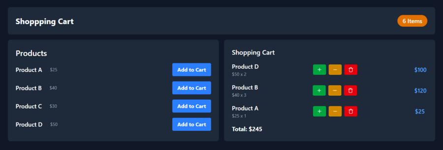

# Shopping Cart Application

This is a simple shopping cart application built with React.js and Typescript. It allows users to add products to a cart, increase or decrease product quantities, and remove products from the cart.

## Features

- **Add to Cart**: Add products to the shopping cart.
- **Increase Quantity**: Increase the quantity of a product in the cart.
- **Decrease Quantity**: Decrease the quantity of a product in the cart.
- **Remove from Cart**: Remove a product from the cart.
- **View Total Items**: Display the total number of items in the cart.

## License

This project is licensed under the MIT License.
