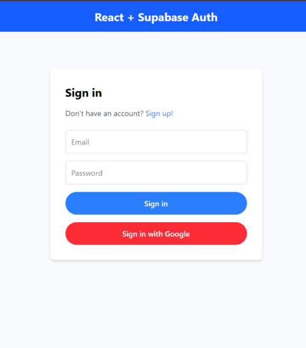
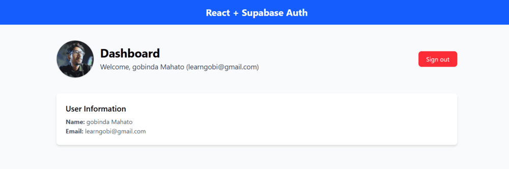

# 🚀 **Supabase Auth with React**

### This project is a **React application** that integrates **Supabase** for authentication. It offers **email-password authentication**, **Google OAuth**, and **session management** with React Context API. The app uses **TailwindCSS** for styling and React Router for navigation.

---

### **User Authentication**

- **Sign-up:** Create a new user account with **email and password**.
- **Sign-in:** Log in with existing credentials.
- **Google OAuth:** Sign in using your **Google account**.
- **Sign-out:** Log out of the application securely.

## **Environment Variables**

Create a `.env` file and add the following:
\`\`\`env
REACT_APP_SUPABASE_URL=your-supabase-url
REACT_APP_SUPABASE_ANON_KEY=your-supabase-anon-key
\`\`\`

---

## **Authentication Flow**

1. **Sign Up:** Create an account with **email and password**.
2. **Login:** Authenticate using **email-password** or **Google OAuth**.
3. **Session Management:** The app automatically persists the user session.
4. **Sign Out:** Click the **Sign Out** button to log out.

---

## 📜 **License**

This project is licensed under the **MIT License**.
Feel free to modify and use it for your projects. 🎯
