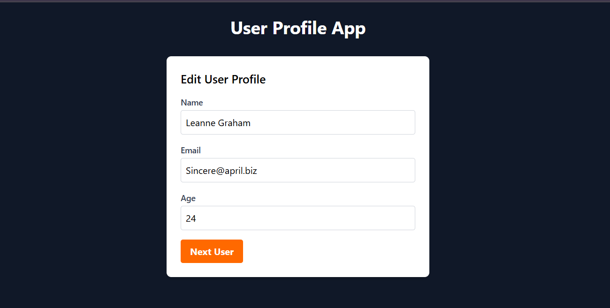

# User Profile App

This is a simple React application that fetches and displays user profiles from an API. Users can navigate through a list of profiles and reset the list when they reach the end.

## Features

- Fetch user data from an external API.
- Display user profiles with name, email, and age.
- Navigate through profiles using a "Next" button.
- Reset the list when no more profiles are available.

API
This app fetches user data from JSONPlaceholder.

License
This project is open-source and available under the MIT License.
